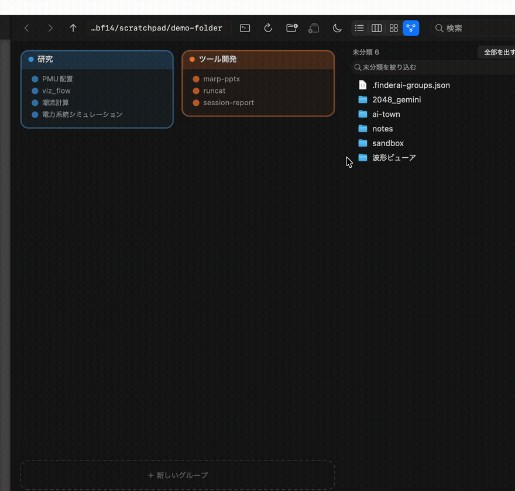

# グループ — フォルダを作らずにまとめる

`~/Documents/GitHub` に146個のリポジトリが平らに並んでいる。整理したいが、フォルダを作って中へ移すと、gitのパスも、シンボリックリンクも、ビルドスクリプトに書いたパスも壊れる。

グループは**実体を一つも動かさずに**「どれとどれが同じか」を書き留める。フォルダの中に置いた一枚のJSONがその記述で、ファイルシステムには何も起きない。



## どこに書かれるか

まとめた**そのフォルダ自身**に、隠しファイルとして置かれる。

```
~/Documents/GitHub/.finderai-groups.json
```

まとめる相手と同じ場所に並べたくないので隠しファイルにしてある。グループが在ることは一覧の見出しとして見えるので、ファイルまで見せる必要はない。

フォルダごと別のマシンへ移しても、同期先で開いても、定義はそのまま生きる。メンバーを**フォルダ直下の名前**で持っていて、絶対パスを持たないから。

## 形

```json
{
  "groups" : [
    {
      "members" : [
        "pandapower-lab",
        "電力系統シミュレーション"
      ],
      "name" : "研究"
    },
    {
      "members" : [
        "viz_flow",
        "power_flow_viz"
      ],
      "name" : "可視化",
      "parent" : "研究"
    },
    {
      "members" : [],
      "name" : "あとで読む"
    }
  ],
  "version" : 1
}
```

| キー | 意味 |
|---|---|
| `version` | いまは `1`。読めない版のときに黙って壊さないための番号 |
| `groups` | グループの配列。**この並びが表示順**（一覧の見出しの順、地図の島の順） |
| `groups[].name` | グループの名前。日本語でよい。一覧の見出しと地図の島に出る |
| `groups[].members` | **フォルダ直下の名前**の配列。パスではない。順序は追加順で、表示順ではない |
| `groups[].parent` | 親グループの名前。省略か `null` なら最上位。`A ∈ B` の入れ子を表す |

保存するときは、キーを並べ替えて、インデントを付けて書く。このファイルをgitに入れる人の差分が、中身が同じなのに毎回変わる、ということが起きないように。

## 規則

**一つの項目が複数のグループに属してよい。** 「ツール開発」であり同時に「Swift」でもある、というのは分類の失敗ではなく普通のこと。排他にすると、どちらか片方を選ばせることになる。

一覧では、複数のグループに属する項目は**その全部の見出しの下に現れる**。同じ実体が二行に見えるが、タグでまとめたものを平らに並べれば必ず起きることで、隠す道がない。地図では**一つの点**として、属する島の境界に立つ（輪が所属の数で割れる）。

**グループは一つの親しか持てない。** 項目の複数所属とは事情が違う。二つの親に同時に属せると、一覧のどこに出すべきかが決まらない。

**輪になる指定は断る。** `A ∈ B` のときに `B ∈ A` は入らない。親を辿る処理が無限に回るため。自分自身を親にするのも同じ。

**空のグループは残る。** 中身をすべて出しても定義は消えない。落とし先の見出しが無いと最初の一個を入れられないし、「最後の一個を出したらグループごと消えた」は取り返しがつかない。

**実物が無いメンバーも残る。** 別のマシンにしか無いフォルダの定義を消さないため。ただし黙って落とすと定義にゴミが溜まるので、地図の島に「見つからない N」と数を出す。押せば整理できる。

**グループを消しても、中のものは一つも減らない。** グループは「どれとどれが同じか」の記述にすぎない。親を消したときは、子は最上位へ引き上げる（消したつもりのないものが消えないように）。

## 手で書く

このファイルは手で開いて直せることを前提にしている。エディタで書き換えて保存すれば、次に開いたときに反映される。

壊れたJSONは**読めなかったこととして扱う**。空の定義として読み替えて次の保存で上書きすると、手で書いたグループが本当に消える。読めないときは一覧に見出しを出さず、ステータスに理由を出す。

```jsonc
{
  "version": 1,
  "groups": [
    // メンバーが空でもよい。落とし先として使える
    { "name": "研究", "members": [] },
    // 入れ子。親が存在しない名前を指していたら、最上位として扱う
    { "name": "電力系統", "members": ["Japan_Swing"], "parent": "研究" }
  ]
}
```

※ 上のコメントは説明のためのもので、JSONにコメントは書けない。

## 名前が変わったら、実体が消えたら

メンバーを**名前**で持っているので、名前や存在が変わったときに定義がどうなるかは、
この仕組みの要になる。

| 起きたこと | 定義 | なぜ |
|---|---|---|
| アプリの中で名前を変えた | 書き換わる | 名前を変えただけで束から落ちるなら、「実体を動かさずにまとめる」が守れていない |
| その取り消し | 戻る | 名前を戻す処理を同じ道で通しているため |
| ゴミ箱に入れた | 名前が残り、地図に「見つからない N」と出る | ゴミ箱から戻せば束も戻る。自動で外すと、戻したときに束から落ちたままになる |
| 別のマシンにしか無い | 同上 | 同期していないフォルダの定義を消さずに持っておくため |
| 複製した（⌘D） | コピーは束に入らない | 別のものなので |
| 外（Finderやシェル）で名前を変えた（**そのフォルダを開いているあいだ**） | 書き換わる | 開いたときに覚えたファイルの印（ボリューム・inode・作成時刻）と一致するので、**同じものだと確かめられる** |
| 外で名前を変えた（**閉じているあいだ**） | 名前が残り「見つからない」 | 覚えている印が無い。外からは「Aが消えてBが増えた」としか見えず、推測で結ぶと**別物を束に入れる** |
| 別の場所へ移動した | 同上 | 束はフォルダに属するので、移った先は別の定義になる |
| 消したあと、同じ名前で作り直した | 別物として扱う（束に入らない） | 印が違う。inodeは使い回されることがあるので、作成時刻まで見ている |

「見つからない」が溜まったら、**その島の**「見つからない N →」（地図）か、見出しの
右クリックの「見つからない N 件を外す…」（一覧）で外せる。メニューの
「見つからない項目を整理…」は全部の束をまとめて整理する。外す前に、どの束の
どの名前が消えるのかを並べて見せる。

**自動では外さない** — 消えたように見えるだけのもの（外付けディスクを外した、
同期がまだ、名前を戻す途中）を、黙って束から落とさないため。

## アプリからの操作

| したいこと | 手 |
|---|---|
| グループを作る | 選んでツールバーの「グループを作る」、右クリック、または地図の「＋ 新しいグループ」に引く |
| 入れる | 一覧の見出しへ引く／地図の島へ引く／右クリックの「グループに入れる」 |
| 張り替える | 地図で点を掴んで別の島へ引く（⌥を押しながらなら、元にも残したまま増やす） |
| 外す | 右クリックの「グループから外す」 |
| 名前を変える・順を変える・解く | 見出しを右クリック |
| 入れ子にする | 見出しを右クリック →「このグループを入れる先」 |
| 未分類だけ見る | 一覧の「未分類だけ」／地図の右上の「未分類だけ」 |
| 束だけ見る | 一覧の「グループのものだけ」 |

## 地図

グループを島として並べ、複数のグループに属するものを島の境界に置く。一覧では二行に割れてしまうものが、ここでは一つの点として両方の色を持つ。**重なりが場所として見える**のがこの表示の目的で、それ以外の用途では一覧のほうが速く読める。

- **島にも名前を全部出す（既定）。** 概要だけにして畳む案もあったが、そうすると
  島へ引いて入れるときに何が入っているか見えない。地図を「重なり専用」と割り切る
  ところまではしない、と決めた（2026-08-15）
- ただし**畳める**。島の見出しの右の三角を押すと、名前の代わりに
  「単独 12　重なり 8　合計 20」の一行になる。親を畳むと子も連れて畳む。
  畳んだ状態は一覧と共有していて、一覧で畳んだ束は地図でも畳まれている
- **束の数でレーンを分けることはしない。** 2束の枠と3束の枠は同じ流れに並ぶ
- 島の高さは中身の量そのもの。画面に合わせて引き伸ばさない
- 入りきらないぶんは紙のほうが縦に伸びる（スクロールで辿る）。上限は置いていない
- 長い紙をスクロールしているあいだ、島の名前は**見えている上端に留まる**。
  いまどの島の中に居るかが読めないと、全部出ていても探せない
- 島の名前をダブルクリックすると、その束だけが地図いっぱいに広がる。広げた先で
  子の束の名前を叩けば、さらに降りられる。`esc` と「←」は**一段ずつ**戻る
- 右の一覧は、一覧表示と同じグループ対応のリスト。列（名前・変更日・サイズ・種類・
  グループ）も並べ替えも名前の変更も同じ。幅が足りないときは右の列から畳む。
  引いてきたファイルを落とせる（フォルダの行ならその中へ、地ならこのフォルダへ）

## 重なりの見せ方

複数の束に属するものは、島の中には入れず「**研究 × ツール開発**」という枠に集める。
その枠に居るのは**ちょうどその組み合わせ**のものだけで、三つに属するものは
「研究 × ツール開発 × Swift」という別の枠に入る。見出しの右の「2束だけ」がそれを言う。

枠は両端に色の柱が立つ。左の束から右の束へ渡している形で、ふつうの島と見分けが付く。
行の点は色を分けた丸。

枠から別の島へ引くと、**その島にも入る**（どちらかの所属と入れ替えるのではない）。
AとBの両方に属するものをCへ引いたとき、AをCに替えるのかBを替えるのかは決めようがない。
外したいときは右クリックの「グループから外す」を使う。
