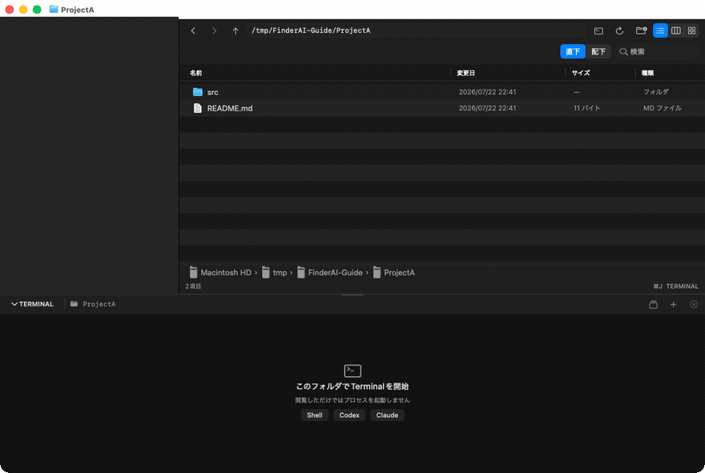
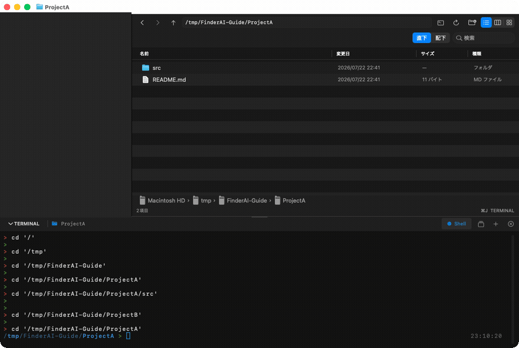
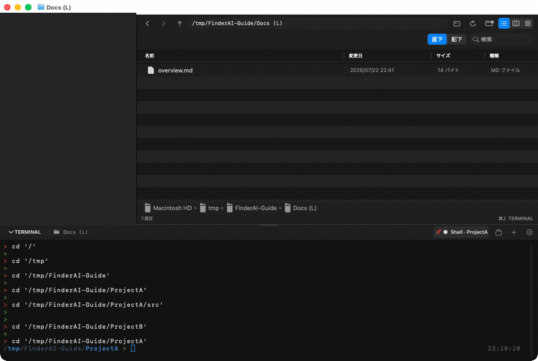
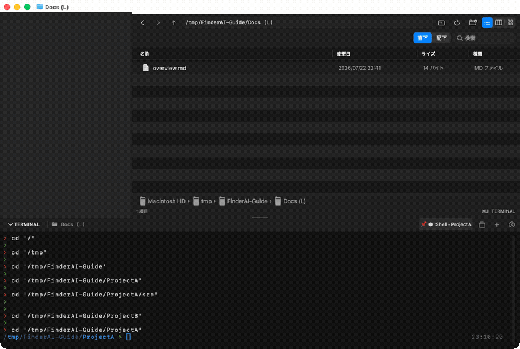

# FinderAI 使い方ガイド

ブラウザ（ファイル一覧）とTerminalが1枚のウインドウに同居し、**お互いの場所を追いかけ合う**のがFinderAIの中心機能です。このガイドは実際の操作を録画したGIFで主要機能を説明します。

> GIFは v1.10.2 で収録。サイドバー部分は塗りつぶしてあります。

## 1. Shellはフォルダ移動に追従して自分もcdする

ドロワーの`＋`（または空の状態の`Shell`ボタン）でShellを開くと、以後**フォルダをクリックして移動するたびにShell自身が`cd`して付いてきます**。プロンプトの現在地表示がブラウザと常に一致します。

安全のため、cdが送られるのは**シェルがプロンプトで待機しているときだけ**です:

- コマンド実行中・vim等のTUI表示中は何も送りません
- 打ちかけの入力があるときは`^C`で行を破棄してから移動するので、入力と混ざって誤実行されることはありません
- **Claude／CodexのAIセッションには何があっても文字を送りません**

## 2. 📌固定と、タブのダブルクリックでジャンプ

タブを右クリック →「**フォルダ移動に追従（cd）**」のチェックを外すと、そのShellは📌付きになり**その場に固定**されます。別のフォルダへ移動してもcdは送られず、タブに「📌 ●  Shell · フォルダ名」と**所属フォルダが表示されたまま残ります**。

**タブをダブルクリックすると、ブラウザがそのセッションの現在地へジャンプ**します。シェルの中で手動`cd`した後でも、実際の作業ディレクトリを開きます。

タブ帯の見かた:

| 表示 | 意味 |
|---|---|
| 青いタブ | いま見ているフォルダで動いているセッション |
| グレー + `· フォルダ名` | 別のフォルダで動いているセッション（消えません） |
| `📌` | 固定中（フォルダ移動に追従しない） |
| `●` | プロセス実行中 |

## 3. “cd” コマンドをコピー（外部ターミナル用）

アドレスバー右の**ターミナルアイコン**をクリックすると、現在のフォルダへの`cd`コマンドが**シェル用にエスケープ済み**でクリップボードに入ります（1秒間チェックマークで確認表示）。`Docs (L)`のような**括弧・スペース・日本語入りのパスでも、Terminal.appなどに貼ってreturnを押すだけ**で移動できます。

- 素のパスが欲しいときは、下部パスバーの右クリック →「パス名をコピー」
- `⌥⌘C`は選択中の項目（未選択なら現在フォルダ）のパス名をコピーします

## 4. フォルダの移動・リネームに画面が追従する

表示中のフォルダ（またはその上位フォルダ）が**Finderやシェルなど外部でリネーム・移動されても**、タイトル・パス表示・履歴ごと新しい場所へ自動で追従します。削除やゴミ箱行きのときは、残っている最も近い上位フォルダへ退避します。

## 5. 本物のFinderとの行き来

- **移動メニュー →「Finderの現在地を開く」（`⇧⌘F`）**: 本物のmacOS Finderの最前面ウインドウが表示しているフォルダをFinderAIで開きます。初回のみ「FinderAIがFinderを制御しようとしています」の許可が必要です
- ファイル右クリック →「**Finderで表示**」: 逆方向。選択項目を本物のFinderで表示します

## 主なショートカット

| キー | 動作 |
|---|---|
| `⌘L` | パスを入力して移動 |
| `⌘J` | Terminalの開閉 |
| `⌘F` | このフォルダを検索（直下／配下） |
| `⌥⌘C` | パス名をコピー |
| `⇧⌘F` | Finderの現在地を開く |
| `⌘⌥T` | すべてのTerminalセッションを管理 |
| `⌘N` / `⌘⌥S` | 新規ウインドウ / 2画面分割 |

より詳しい仕様は[README](../README.md)と[ARCHITECTURE](../ARCHITECTURE.md)を参照してください。
